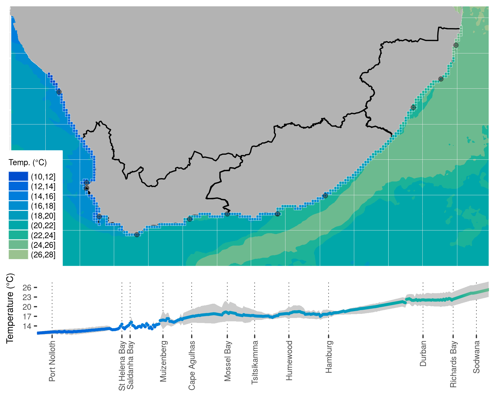

# Mapping with **`ggplot2`** {#mapping}

> "There's no map to human behaviour."
>
> --- Bjork
  
> "Here be dragons"
> 
> --- Unknown

```{r mapping-opts, echo=FALSE}
knitr::opts_chunk$set(
  comment = "R>", 
  warning = FALSE, 
  message = FALSE
)
```

Yesterday we learned how to create some basic figures in R and how to change the aesthetics, static values, and colour palettes of those figures. Now we are going to look at how to create maps in R. 

Most of the work that we perform as biologists involves going out to a location and sampling information there. Sometimes only once, and sometimes over a period of time. All of these different sampling methods lend themselves to different types of figures. One of those, collection of data at different points, is best shown with maps. As we will see just now, creating maps in R is very straight forward. For that reason we are going to have plenty of time today to learn how to do some more advanced things. Our goal is to produce something similar to the figure below.

```{r mapping-init}
# Load libraries
library(tidyverse)
library(gridExtra)

# Load data
load("data/south_africa_coast.Rdata")
load("data/sa_provinces.Rdata")
load("data/site_list.Rdata")
load("data/rast_annual.Rdata")
load("data/rast_aug.Rdata")
load("data/rast_feb.Rdata")
load("data/MUR.Rdata")

# The colour pallette we will use
cols11 <- c("#004dcd", "#0068db", "#007ddb", "#008dcf", "#009bbc",
            "#00a7a9", "#1bb298", "#6cba8f", "#9ac290", "#bec99a")
```


```{r map-fig-1, echo = FALSE, fig.cap = "The goal for today."}
knitr::include_graphics("figures/map_complete.pdf")
```

## A new concept?

The idea of creating a map in R may be daunting to some, but remember that a basic map is nothing more than a simple figure with an x and y axis. We tend to think of maps as different from other scientific figures, whereas in reality they are created the exact same way. Let's compare a dot plot of the chicken data against a dot plot of the coastline of South Africa.

Chicken dots:

```{r map-point-1}
ggplot(data = ChickWeight, aes(x = Time, y = weight)) +
  geom_point()
```

South Africa coast dots:

```{r map-point-2}
ggplot(data = south_africa_coast, aes(x = lon, y = lat)) +
  geom_point()
```

Does that look familiar? Notice how the x and y axis tick labels look the same as any map you would see in an atlas. This is because they are. But this isn't a great way to create a map. Rather it is better to represent the land mass with a polygon. With the ggplot system this is a simple task.

## Creating a map

Now that we have seen that a map is nothing more than a bunch of dots and shapes on specific points along the x and y axes we are going to look at the steps we would take to build a more complex map. Don't worry if this seems daunting at first. We are going to take this step by step and ensure that each step is made clear along the way. We will start by making a basic landmass background using the `geom_polygon()` function.

```{r map-base}
ggplot(data = south_africa_coast, aes(x = lon, y = lat)) +
  geom_polygon(aes(group = group), fill = "grey70") + # The polygon
  coord_equal()
```

Now our map has a solid picture of South Africa in it. Next up let's add the province borders for the three provinces as seen in \@ref(fig:map-fig-1). Notice how we only add one more line of code to do this.

```{r map-province}
ggplot(data = south_africa_coast, aes(x = lon, y = lat)) +
  geom_polygon(aes(group = group), fill = "grey70") +
  geom_path(data = sa_provinces, aes(group = group)) + # The three province borders
  coord_equal()
```

This is starting to look pretty fancy, but it would be nicer if there was some colour involved. So let's add the ocean temperature. Again, this will only require one more line of code. Starting to see a pattern? But what is different this time and why?

```{r map-MUR}
ggplot(data = south_africa_coast, aes(x = lon, y = lat)) +
  geom_raster(data = MUR, aes(fill = bins)) + # The ocean temperatures
  geom_polygon(aes(group = group), fill = "grey70") +
  geom_path(data = sa_provinces, aes(group = group)) +
  coord_equal()
```

That looks... odd. Why do the colours look like someone melted a big bucket of ice cream in the ocean? This is because the colours you see in this figure are the default colours for discrete values in ggplot. If we want to change them we may do so easily by adding yet one more line of code.

```{r map-colour}
ggplot(data = south_africa_coast, aes(x = lon, y = lat)) +
  geom_raster(data = MUR, aes(fill = bins)) +
  geom_polygon(aes(group = group), fill = "grey70") +
  geom_path(data = sa_provinces, aes(group = group)) +
  scale_fill_manual("Temp. (°C)", values = cols11) + # Set the colour palette
  coord_equal()
```

Now there is a colour palette that would make even Jacques Cousteau swoon. When we set the colour palette for a figure in ggplot we must use that colour palette for all other instances of those types of values, too. What this means is that any other discrete values that will be filled in, like the ocean colour above, must use the same colour palette (there are some technical exceptions to this rule that we will not cover in this course). We normally want ggplot to use consistent colour palettes anyway, but it is important to note that this constraint exists. Let's see what we mean. Next we will add the coastal pixels to our figure with one more line of code. We won't change anything else. Note how ggplot changes the colour of the coastal pixels to match the ocean colour automatically. Let's also add some points to highlight major cities while we are at it.

```{r map-raster}
ggplot(data = south_africa_coast, aes(x = lon, y = lat)) +
  geom_raster(data = MUR, aes(fill = bins)) +
  geom_polygon(aes(group = group), fill = "grey70") +
  geom_path(data = sa_provinces, aes(group = group)) +
  geom_tile(data = rast_annual, aes(fill = bins), 
            colour = "white", size = 0.1) + # The coastal temperature values
  geom_point(data = site_list, alpha = 0.4) + # Coastal city locations
  scale_fill_manual("Temp. (°C)", values = cols11) +
  coord_equal()
```

We used `geom_tile()` instead of `geom_rast()` to add the coastal pixels above so that we could add those little white boxes around them. This figure is looking pretty great now. And it only took a few rows of code to put it all together! The last step is to add several more lines of code that will control for all of the little things we want to change about the appearance of the figure. Each little thing that is changed below is annotated for your convenience.

```{r map-final}
fig_top <- ggplot(data = south_africa_coast, aes(x = lon, y = lat)) +
  geom_raster(data = MUR, aes(fill = bins)) +
  geom_polygon(aes(group = group), fill = "grey70") +
  geom_path(data = sa_provinces, aes(group = group)) +
  geom_tile(data = rast_annual, aes(fill = bins), 
            colour = "white", size = 0.1) + 
  geom_point(data = site_list, alpha = 0.4) +
  scale_fill_manual("Temp. (°C)", values = cols11) +
  coord_equal(expand = 0) + # Remove extra plot area
  theme(axis.title = element_blank(), # Remove the axis labels
        axis.text = element_blank(), # Remove the axis text
        axis.ticks = element_blank(), # Remove the axis ticks
        legend.text = element_text(size = 7), # Change text size in legend
        legend.title = element_text(size = 7), # Change legend title text size
        legend.key.height = unit(0.3, "cm"), # Change size of legend
        legend.background = element_rect(colour = "white"), # Add legend background
        legend.justification = c(1, 0), # Change position of legend
        legend.position = c(0.11, 0.00) # Fine tune position of legend
        )
fig_top
```

That is a very clean looking map and is going to serve as the top half of the figure we are making together today. For the bottom half we are now going to look at how to create a ribbon in ggplot.

## A ribbon for your troubles

For the bottom portion of our figure we want to add a ribbon that shows the mean temperature along the coast, as well as the coldest (August) and warmest (February) months of the year. This allows us to visualise what the range of temperatures along the coast are.

```{r ribbon-base}
ggplot(data = rast_annual, aes(x = index, y = temp)) +
  geom_ribbon(aes(ymin = rast_aug$temp, ymax = rast_feb$temp), fill = "grey80") +
  geom_point(aes(colour = temp), size = 0.6)
```

That looks pretty good already. But let's change the colour of the points so that they match the map we are using:

```{r ribbon-colour}
ggplot(data = rast_annual, aes(x = index, y = temp)) +
  geom_ribbon(aes(ymin = rast_feb$temp, ymax = rast_aug$temp), fill = "grey80") +
  geom_point(aes(colour = temp), size = 0.6) +
  scale_colour_gradientn("Temp. (°C)", limits = c(10, 30), colours = cols11, 
                         breaks = seq(12, 28, 4))
```

Notice that whereas the colours look the same, for this ribbon we are using temperature as a continuous variable and not a discrete variable. This is why we have to provide the 'break' information in the line that changes the colours for our ribbon. The next thing we want to do is change the labels for the x and y axes and remove the legend. Because we are going to have a legend in the top half of the figure, we don't need one for the bottom half.

```{r ribbon-axes}
ggplot(data = rast_annual, aes(x = index, y = temp)) +
  geom_ribbon(aes(ymin = rast_feb$temp, ymax = rast_aug$temp), fill = "gray80") +
  geom_point(aes(colour = temp), size = 0.6) +
  scale_colour_gradientn("Temp. (°C)", limits = c(10, 30), colours = cols11, 
                         breaks = seq(12, 28, 4)) +
  guides(colour = FALSE) + # Remove the legend
  labs(x = "", y = "Temperature (°C)") + # Change the x and y axis label
  scale_y_continuous(breaks = seq(14, 26, 3), 
                     expand = c(0, 0)) + # Change the y axis ticks
  scale_x_continuous(breaks = site_list$index2, 
                     labels = site_list$site, expand = c(0, 0)) # Change x axis ticks
```

It may look like we have taken a step backward, but we are about to sort everything out in a very nice way. To do this we will need to manipulate the minutia of the figure using `theme()`. Again, we will label each line to add clarity to the process.

```{r ribbon-final}
fig_bottom <- ggplot(data = rast_annual, aes(x = index, y = temp)) +
  geom_ribbon(aes(ymin = rast_feb$temp, ymax = rast_aug$temp), fill = "gray80") +
  geom_point(aes(colour = temp), size = 0.6) +
  scale_colour_gradientn("Temp. (°C)", limits = c(10, 30), colours = cols11, 
                         breaks = seq(12, 28, 4)) +
  guides(colour = FALSE) +
  labs(x = "", y = "Temperature (°C)") +
  scale_y_continuous(breaks = seq(14, 26, 3), 
                     expand = c(0, 0)) +
  scale_x_continuous(breaks = site_list$index2, 
                     labels = site_list$site, expand = c(0, 0)) +
  theme(panel.background = element_blank(), # Remove the panel background
        panel.border = element_blank(), # Remove the panel border
        plot.background = element_blank(), # Remove the background
        panel.grid.major.x = element_line(colour = "black", 
                                          linetype = "dotted", 
                                          size = 0.2), # Change the x axis gridlines
        panel.grid.major.y = element_line(colour = NA), # Remove the y axis gridlines
        axis.text.x = element_text(angle = 90, 
                                   hjust = 1, 
                                   vjust = 0.5, 
                                   size = 7), # Change the x axis labels
        axis.text.y = element_text(size = 7), # Change the y axis labels
        axis.title.y = element_text(size = 8) # Change y axis title size 
        )
fig_bottom
```

And there we have it. This is a very nice ribbon figure showing the annual range of temperatures along the coast of South Africa. But it relies on the map figure to be complete.

## Combining figures

We learned yesterday how to combine figures in ggplot. With that line of code we saw how to combine all of the figures in equal grids. Now we want the map panel of the figure to be twice as high as the ribbon panel. The following line of code will now round out the whole process for today.

```{r save-fig, eval=FALSE}
# Create an object that contains all of the map data
final <- grid.arrange(fig_top, fig_bottom, layout_matrix = cbind(c(1,1,2), c(1,1,2)))
ggsave(plot = final, "figures/map_complete.pdf")
```

```{r final-fig, echo=FALSE, fig.cap="The finished product of our efforts."}

```
