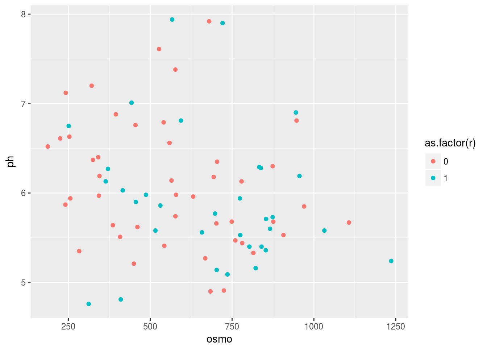
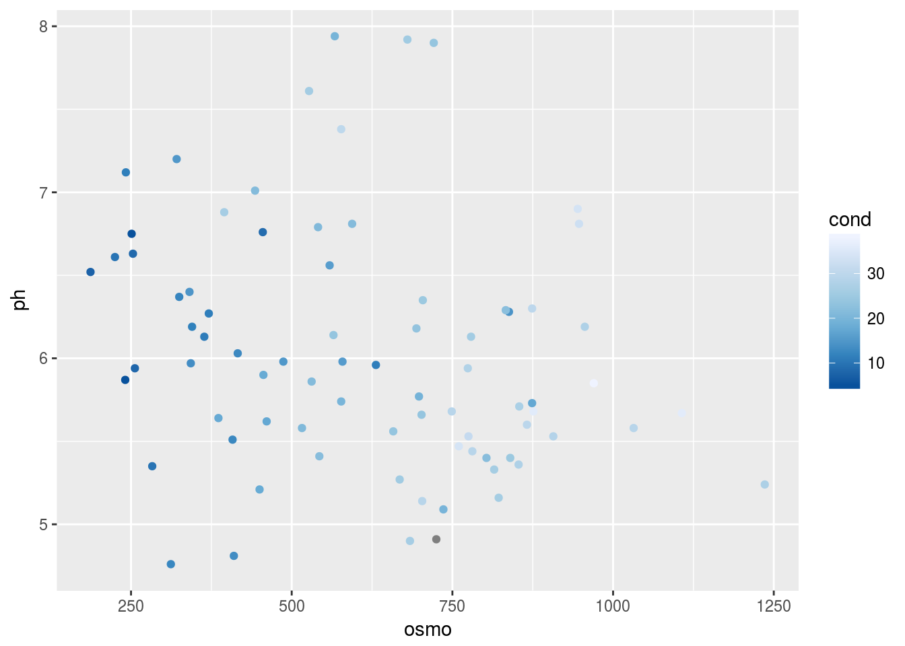
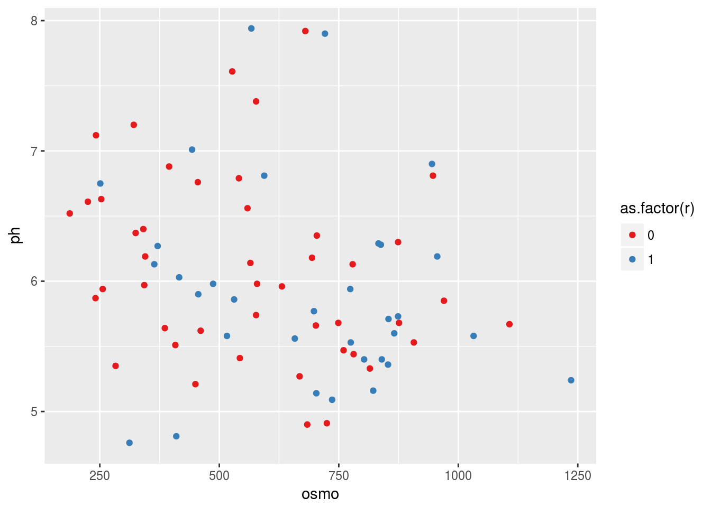
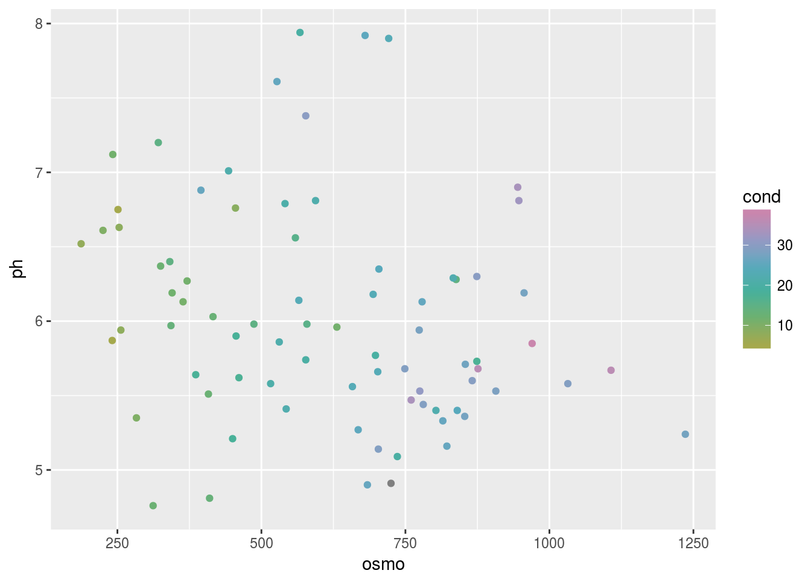
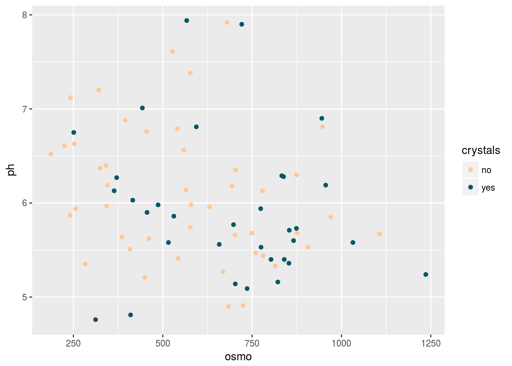

# Brewing colours in **`ggplot2`** {#brewing}

> "Every portrait that is painted with feeling is a portrait of the artist, not of the sitter."
>
> --- Oscar Wilde
  
> "If you could say it in words, there would be no reason to paint."
>
> --- Edward Hopper


Now that we have seen the basics of **`ggplot2`**, let's take a moment to delve further into the beauty of our figures. It may sound vain at first, but the colour palette of a figure is actually very important. This is for two main reasons. The first being that a consistent colour palette looks more professional. But most importantly it is necessary to have a good colour palette because it makes the information in our figures easier to understand. The communication of information to others is central to good science.

## R Data

Before we get going on our figures, we first need to learn more about the built in data that R has. The base R program that we all have loaded on our computers already comes with heaps of example dataframes that we may use for practice. We don't need to load our own data. Additionally, whenever we install a new package (and by now we've already installed dozens) it usually comes with a new dataframe or twenty. To look at the data that we have available across all of our packages we use the following code:


```r
data(package = .packages(all.available = TRUE))
```

We have an amazing amount of data available to us. So the challenge is not to find a dataframe that works for us, but to just decide on one. My preferred method is to read the short descriptions of the dataframes and pick the one that sounds the funniest. But please use whatever method makes the most sense to you. Let's take several minutes to look through all of the data available on our computers and pick out three that we like. One note of caution, in R there are two different forms of data. Wide and long. We will see in depth what this means on Day 4, and what to do about it. For now we just need to know that **`ggplot2`** works much better with long data. To look at a dataframe of interest we use the same method we would use to look up a help file for a function.

Over the years I've installed so many packages on my computer that it is difficult to chose a dataframe. The package **`boot`** has some particularly interesting dataframes with a biological focus. I recommend installing it if you would like access to these data. I have decided to load the `urine` dataframe here. Note that `library(boot)` will not work on your computer if you have not installed the package yet. With these data we will now make a scatterplot with two of the variables, while changing the colour of the dots with a third variable.


```r
# Load libraries
library(ggplot2)
library(boot)

# Load data
urine <- boot::urine

# Look at help file for more info
# ?urine

# Create a quick scatterplot
ggplot(data = urine, aes(x = osmo, y = ph)) +
  geom_point(aes(colour = cond))
```


And now we have a scatterplot that is showing the relationship between the osmolarity and ph of urine, with the conductivity of those urine samples shown in shades of blue. What is important to note here is that the colour scale is continuous. How can we now this by looking at the figure? Let's look at the same figure but use a discrete variable for colouring.


```r
ggplot(data = urine, aes(x = osmo, y = ph)) +
  geom_point(aes(colour = as.factor(r)))
```



What is the first thing you notice about the difference in the colours? Why did we use `as.factor()` for the colour aesthetic for our points? What happens if we don't use this? Try it now.

## **`RColorBrewer`**

Central to the purpose of **`ggplot2`** is the creation of beautiful figures. For this reason there are many built in functions that we may use in order to have precise control over the colours we use, as well as additional packages that extend our options even further. The **`RColorBrewer`** package should have been installed on your computer and activated automatically when we installed and activated the **`tidyverse`**. We will use this package for its lovely colour palettes. Let's spruce up the previous continuous colour scale figure now.


```r
# The continuous colour scale figure
ggplot(data = urine, aes(x = osmo, y = ph)) +
  geom_point(aes(colour = cond)) +
  scale_colour_distiller() # Change the continuous variable colour palette
```



Does this look different? If so, how? The second page of the colour cheatsheet we included in the course material shows some different colour brewer palettes. Let's look at how to use those here.


```r
ggplot(data = urine, aes(x = osmo, y = ph)) +
  geom_point(aes(colour = cond)) +
  scale_colour_distiller(palette = "Spectral")
```


Does that help us to see a pattern in the data? What do we see? Does it look like there are any significant relationships here? How would we test that?

If we want to use colour brewer with a discrete variable we use a slightly different function.


```r
ggplot(data = urine, aes(x = osmo, y = ph)) +
  geom_point(aes(colour = as.factor(r))) +
  scale_colour_brewer() # This is the different function
```


The default colour scale here is not helpful at all. So let's pick a better one. If we look at our cheatsheet we will see a list of different continuous and discrete colour scales. All we need to do is copy and paste one of these names into our colour brewer function with inverted commas.


```r
ggplot(data = urine, aes(x = osmo, y = ph)) +
  geom_point(aes(colour = as.factor(r))) +
  scale_colour_brewer(palette = "Set1") # Here I used "Set1", but use what you like
```



## Make your own palettes

This is all well and good. But didn't we claim that this should give us complete control over our colours? So far it looks like it has just given us a few more palettes to use. And that's nice, but it's not 'infinite choices'. That is where the Internet comes to our rescue. There are many places we may go to for support in this regard. The following links, in descending order, are very useful. And fun!

- <http://tristen.ca/hcl-picker/#/hlc/6/0.95/48B4B6/345363>
- <http://tools.medialab.sciences-po.fr/iwanthue/index.php>
- <http://jsfiddle.net/d6wXV/6/embedded/result/>

I find the first link the easiest to use. But the second and third links are better at generating discrete colour palettes. Take several minutes playing with the different websites and decide for yourself which one(s) you like.

## Use your own palettes

Now that we've had some time to play around with the colour generators let's look at how to use them with our figures. I've used the first web link to create a list of five colours. I then copy and pasted them into the code below, separating them with commas and placing them inside of `c()` and inverted commas. Be certain that you insert commas and inverted commas as necessary or you will get errors. Note also that we are using a new function to use our custom palette.


```r
ggplot(data = urine, aes(x = osmo, y = ph)) +
  geom_point(aes(colour = cond)) +
  scale_colour_gradientn(colours = c("#A5A94D", "#6FB16F", "#45B19B",
                                    "#59A9BE", "#9699C4", "#CA86AD"))
```



If we want to use our custom colour palettes with a discrete colour scale we use a different function as seen in the code below. While we are at it, let's also see how to correct the title of the legend and its text labels. Sometimes the default output is not what we want for our final figure. Especially if we are going to be publishing it.


```r
ggplot(data = urine, aes(x = osmo, y = ph)) +
  geom_point(aes(colour = as.factor(r))) +
  scale_colour_manual(values = c("#ffc995", "#005a64"), # How to use custom palette
                     labels = c("no", "yes")) + # How to change the legend text
  labs(colour = "crystals") # How to change the legend title
```



So now we have seen how to control the colours palettes in our figures. I know it is a but much. Four new functions just to change some colours! That's a bummer. Don't forget that one of the main benefits of R is that all of your code is written down, annotated and saved. You don't need to remember which button to click to change the colours, you just need to remember where you saved the code that you will need. And that's pretty great in my opinion.
