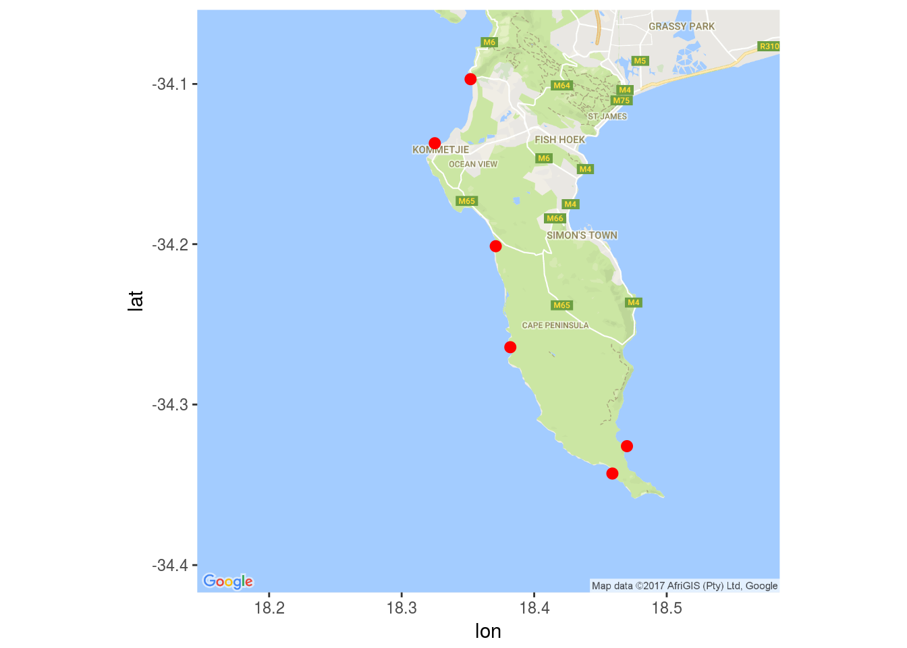
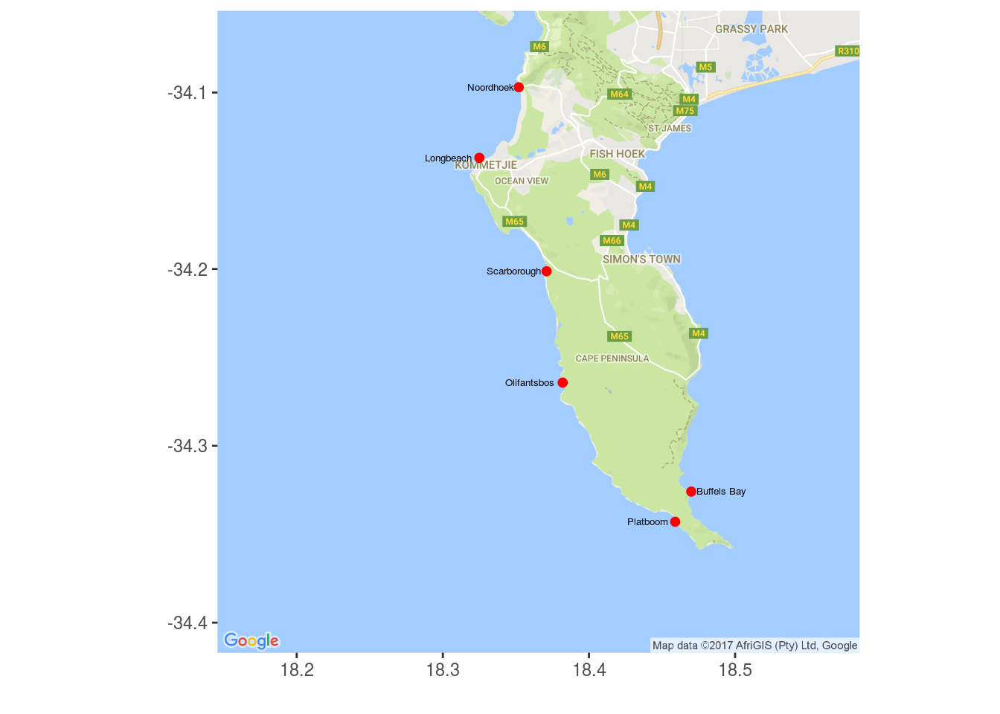

# Mapping with Google {#mapping_google}

> "Why doesn't someone just tell Dora about Google maps so we can all live in a normal world."
>
> --- Owl City
  
> "The only thing Google has failed to do, so far, is fail."
>
> --- John Battelle


Now that we've seen how to produce complex maps with ggplot we are going to learn how to create maps using Google maps. Some kind hearted person has made a package for R that allows us to do this relatively easily. But that means we will need to install another new package. So let's get started!

## **`ggmap`**

The package we will need for this tut is, as you may have guessed, **`ggmap`**. It is a bit beefy so please start installing it now.


```r
# install.packages("ggmap")
library(ggmap)
library(ggplot2)
```

With our new package installed and activated we now need to load some data that we will use for plotting on top of the Google map.


```r
load("data/cape_point_sites.Rdata")
```

Take a moment to look at the data we loaded. What does it show?

## Mapping Cape Point

To create our Google map we are going to use two steps. The first step is to use the `get_map()` function to tell Google what area of the world we want a map of, as well as what sort of map we want. Remember how Google maps can be switched from satellite view to map view? We may do that in R as well. For now we are only going to use the map view as it will download faster, and looks tidier. But if we look in the help file we may see a description of all the different map types available. There are a bunch!

> **Internet connections**  
Much of the code in this document relies on a healthy Internet connection to run. The downloading of Google maps, for example, can be a tenuous process without a stable connection. For that reason (almost) all of the lines of code that require an Internet connection are commented out in this book.


```r
# cape_point <- get_map(location = c(lon = 18.36519, lat = -34.2352581),
#                         zoom = 11, maptype = 'roadmap')
load("data/cape_point.Rdata")
```

If we look in the environment panel in the top right corner, what do we see? What do we think the code above is doing?

The second step is to treat the Google data we downloaded as though it is just any ordinary **`ggplot2`** object. The same as the ones we created in class yesterday and today. For this reason we may use `+` to add new lines of ggplot code to the Google object we downloaded in order to show site locations etc. Let's first just see how the map looks when we add some points. Note that we do not use the function `ggplot()` at the beginning of our code, but rather `ggmap()`.


```r
ggmap(cape_point) +
  geom_point(data = cape_point_sites, aes(x = lon+0.002, y = lat-0.007), 
             colour = "red", size =  2.5)
```



Pretty cool huh?! You may do this for anywhere in the world just as easy as this. The only thing you need to keep in mind is that the `lon`/`lat` coordinates for Google appear to be slightly different than the global standard. It is very curious. This is why the points in the code above have a little bit added or subtracted from their coordinates. 

To round out this short session let's clean this figure up a bit and add text labels for the sites.


```r
ggmap(cape_point) +
  geom_point(data = cape_point_sites, aes(x = lon+0.002, y = lat-0.007), 
             colour = "red", size =  1.75) +
  geom_text(data = cape_point_sites[3,], 
            aes(lon+0.002, lat-0.007, label = site),
            hjust = -0.1, vjust = 0.5, size = 1.75) + # Only the third site
  geom_text(data = cape_point_sites[-3,], 
            aes(lon+0.002, lat-0.007, label = site),
            hjust = 1.1, vjust = 0.5, size = 1.75) + # All of the other sites
  labs(x = "", y = "")
```



And there you have it. A nice quick workflow for adding your data to a Google map background. Play around with the different map types you can download and try it for any place you can think of.
