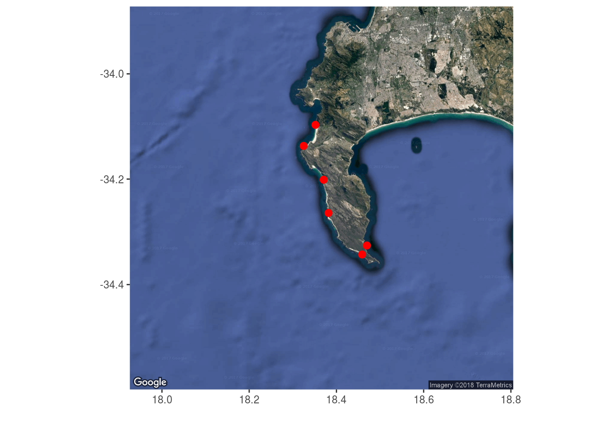
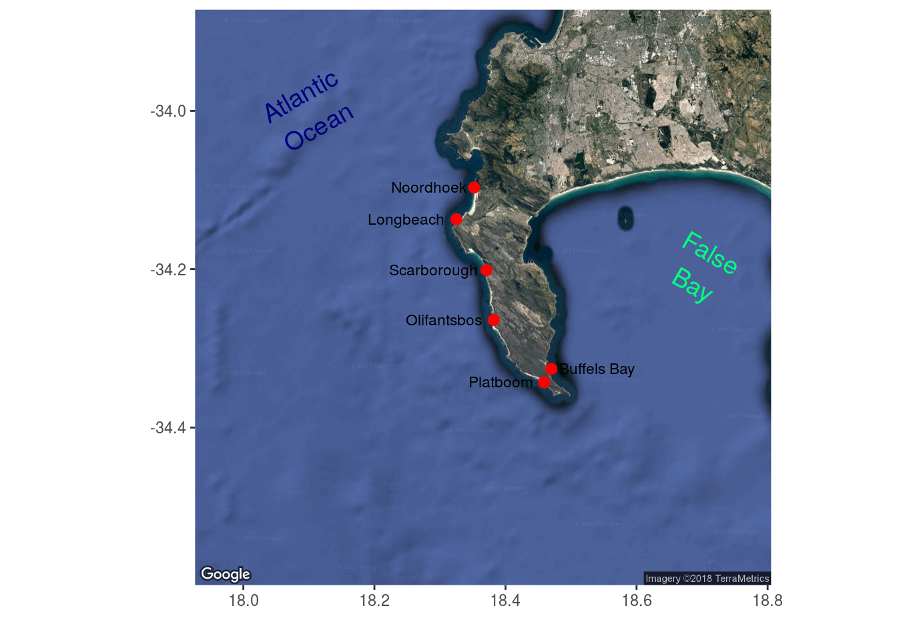
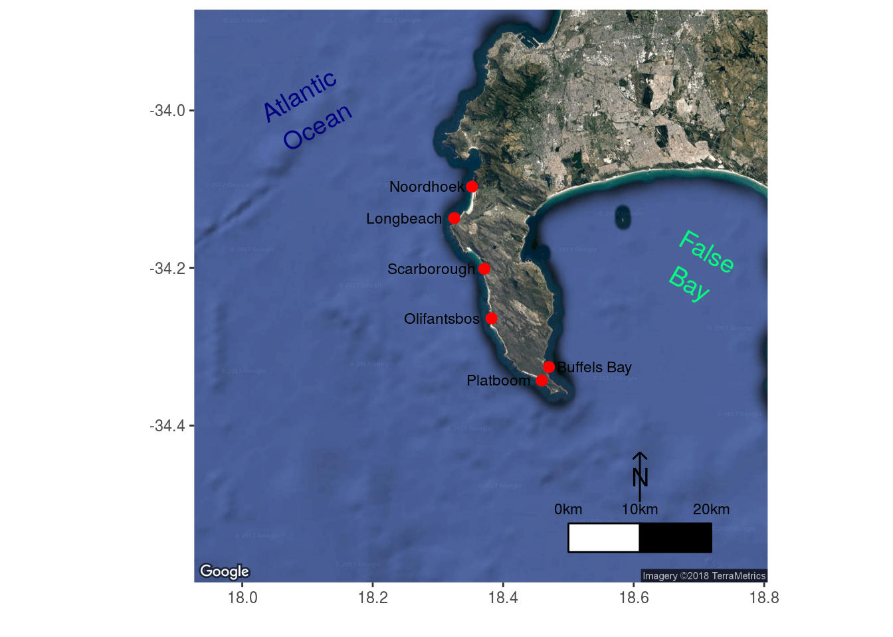
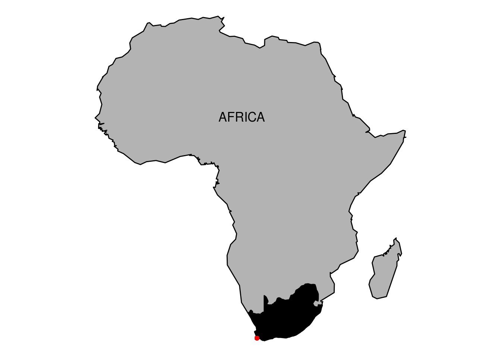
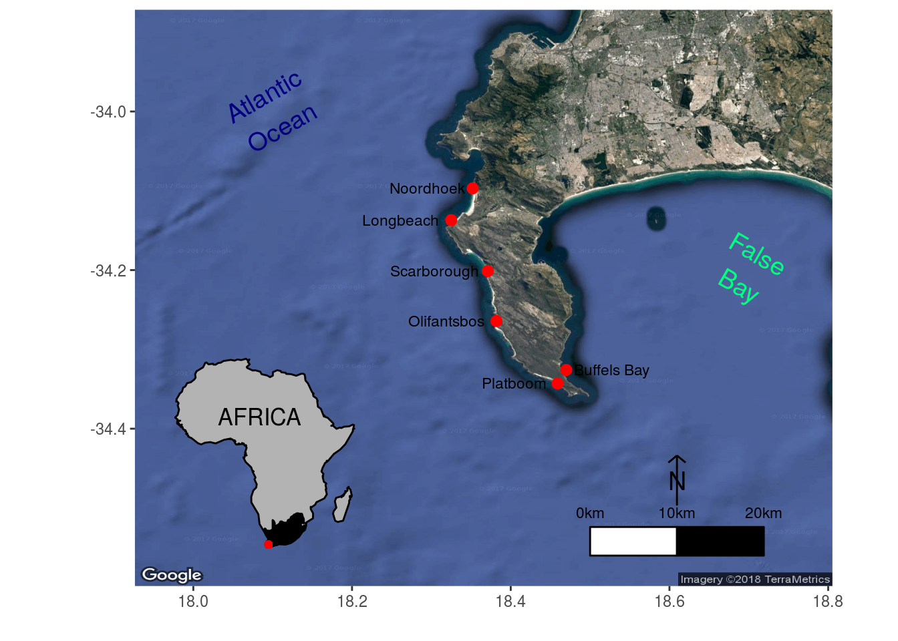

# Mapping with Google {#mapping_google}
  
> "The only thing Google has failed to do, so far, is fail."
>
> --- John Battelle

> “You can’t judge a book by it’s cover but you can sure sell a bunch of books if you have a good one.”
>
> --- Jayce O’Neal


Now that we've seen how to produce complex maps with **`ggplot`** we are going to learn how to bring Google maps into the mix. Some kind hearted person has made a package for R that allows us to do this relatively easily. But that means we will need to install another new package.

After we learn how to use Google maps we will tak some time to learn additional mapping techniques that we may want for creating publication quality figures.

## **`ggmap`**

The package we will need for this tut is **`ggmap`**. It is a bit beefy so let's get started on installing it now. Once it's done we will activated the packages we need and load some site points for mapping.


```r
# Load libraries
library(tidyverse)
library(ggmap)

# Load data
load("data/cape_point_sites.Rdata")
```

Take a moment to look at the data we loaded. What does it show?

## Mapping Cape Point

We will be creating our Google map in two steps. The first step is to use the `get_map()` function to tell Google what area of the world we want a map of, as well as what sort of map we want. Remember how Google maps can be switched from satellite view to map view? We may do that in R as well. For now we are only going to use the satellite view so that we may insert out own labels. But if we look in the help file we may see a description of all the different map types available. There are a bunch!

The `get_map()` function relies on a healthy Internet connection to run. The downloading of Google maps can be a tenuous process without a stable connection. For that reason the following code chunk has the lines of code that require an Internet connection commented out in favour of loading the Google map from a pre-saved file. Please rather run the `get_map()` function first, and if it won't connect only then load the saved file as shown below.


```r
# cape_point <- get_map(location = c(lon = 18.36519, lat = -34.2352581),
#                         zoom = 10, maptype = 'satellite')
load("data/cape_point.Rdata")
```

If we look in the environment panel in the top right corner, what do we see? What do we think the code above is doing?

The second step in the process is to treat the Google data we downloaded as though it is just any ordinary **`ggplot2`** object. The same as the ones we created yesterday and today. For this reason we may use `+` to add new lines of **`ggplot2`** code to the Google object we downloaded in order to show site locations etc. Let's first just see how the map looks when we add some points. Note that we do not use the function `ggplot()` at the beginning of our code, but rather `ggmap()`.


```r
cp_1 <- ggmap(cape_point) +
  geom_point(data = cape_point_sites, aes(x = lon+0.002, y = lat-0.007), 
             colour = "red", size =  2.5) +
  labs(x = "", y = "")
cp_1
```

<div class="figure">

<p class="caption">(\#fig:ggmap-1)Google map of Cape Point with some site locations highlighted with red points.</p>
</div>

Pretty cool huh?! You may do this for anywhere in the world just as easy as this. The only thing you need to keep in mind is that the lon/lat coordinates for Google appear to be slightly different than the global standard. This is why the x and y `aes()` values in the code above have a little bit added or subtracted from them. That one small issue aside, this is a  nice quick workflow for adding your site locations to a Google map background. Play around with the different map types you can download and try it for any place you can think of.

## Site labels

The previous figure shows our sites along Cape Point, which is great, but which site is which?! We need site labels. This is a relatively straightforward processs, so we've given a complicated example of how to do so here.


```r
cp_2 <- cp_1 +
  # Label only the third site
  geom_text(data = cape_point_sites[3,], 
            aes(lon+0.002, lat-0.007, label = site),
            hjust = -0.1, vjust = 0.5, size = 3) +
  # Label all of the other sites
  geom_text(data = cape_point_sites[-3,], 
            aes(lon+0.002, lat-0.007, label = site),
            hjust = 1.1, vjust = 0.5, size = 3)
cp_2
```

<div class="figure">

<p class="caption">(\#fig:ggmap-2)Google map of Cape Point with site labels</p>
</div>

## Specific labels

A map is almost always going to need some labels and other visual cues. We saw in the previous section how to add site labels. The following code chunk shows how this differs if we want to add just one label at a time. This can be useful if ecah label needs to be different from all other labels for whatever reason. We may also see that the text labels we are creating have `\n` in them. When R sees these two characters together like this it reads this as an instruction to returndown a line. Let's run the code to make sure we see what this means.


```r
cp_3 <- cp_2 +
  annotate("text", label = "Atlantic\nOcean", x = 18.1, y = -34.0, 
           size = 5.0, angle = 30, colour = "navy") +
  annotate("text", label = "False\nBay", x = 18.7, y = -34.2, 
           size = 5.0, angle = 330, colour = "springgreen")
cp_3
```

<div class="figure">

<p class="caption">(\#fig:ggmap-labels)Google map of Cape Point with site labels AND specific labels.</p>
</div>

## Scale bars

With our fancy labels added, let's insert a scale bar next. There is no default scale bar function in the **`tidyverse`** unfortunately, rather we will need to import one that has been created by a kind Samaritan. It is a bit finicky and often requires a bit of trial and error to get it to look exactly the way one wants. On the plus side, this also means we have a lot of control over the appearance of the scale bar.


```r
# Load the function for creating scale bars
source("functions/scale.bar.func.R")

# Add a scale bar to our map
cp_4 <- cp_3 +
    scaleBar(lon = 18.50, lat = -34.56, distanceLon = 10, distanceLat = 4, 
             distanceLegend = 6, dist.unit = "km", arrow.length = 7, 
             arrow.distance = 7, arrow.North.size = 5)
cp_4
```

<div class="figure">

<p class="caption">(\#fig:ggmap-scale)Google map of Cape Point with labels and a scale bar.</p>
</div>

## Insetting

In order to inset a smaller map inside of a bigger map, we first need to create the smaller map. Let's make a map of Africa as a demonstration. The built in shape files that come with the **`tidyverse`** are not terribly useful for creating the outline of a given continent, so we will use the shape file of Africa that we already have saved on our computer. See if you can determine what each line of code is doing.


```r
# Load Africa shape
load("data/africa_coast.Rdata")

# Create map
africa_map <- ggplot(data = africa_coast, aes(x = lon, y = lat)) +
  geom_polygon(aes(group = group), colour = "black", fill = "grey70") +
  borders(regions = "South Africa", colour = "black", fill = "black",
          ylim = c(-34, -28)) +
  annotate("text", x = 15, y = 15, label = "AFRICA", size = 4.5) +
  geom_point(aes(x = 18.36519, y = -34.2352581), colour = "red") +
  theme_void() +
  coord_equal()
africa_map
```

<div class="figure">

<p class="caption">(\#fig:ggmap-mini)A quick map of Africa to be insetted in our Cape Point map.</p>
</div>

And now to inset this map of Africa into our map of Cape Point we will need to learn how to create a 'grob'. This is very simple and does not require any extra work on our part. Remember that **`ggplot2`** objects are different from normal objects (i.e. dataframes), and that they have their own way of storing and accessing data. In order to convert any sort of thing into a format that ggplot understands we convert it into a grob, as shown below. Once converted, we may then plop it onto our figure/map wherever we please. Both of these steps are accomplished with the single function `annotation_custom()`. This is also a good way to add logos or any other sort of image to a map/figure. You can really go completely bananas. It's even possible to add GIFs. Such happy. Much excite. Very wonderment.


```r
cp_5 <- cp_4 +
  coord_equal() + # Force new coordinate system for grob to work
  annotation_custom(grob = ggplotGrob(africa_map),
                    xmin = 17.9, xmax = 18.28,
                    ymin = -34.56, ymax = -34.3)
cp_5
```

<div class="figure">

<p class="caption">(\#fig:ggmap-inset)Google map of Cape Point, with labels, scale bar, and an inset map of Africa.</p>
</div>

## Rounding it out

There are a lot of exciting things going on in our figure now. To round out our adventures in mapping let's tweak the lon/alt labels to a more prestigious convention. There are two ways to do this. One of which requires us to install the **`scales`** package. Don't worry, its's a small one!


```r
# Load library
library(scales)

# Polish it off
cp_final <- cp_5 +
  scale_x_continuous(breaks = seq(18.1, 18.7, 0.2),
                     labels = scales::unit_format("°E", sep = ""),
                     position = "top") +
  scale_y_continuous(breaks = seq(-34.4, -34.0, 0.2),
                     labels = c("34.0°S", "34.2°S", "34.4°S"),
                     position = "right") +
  coord_equal(expand = 0)
cp_final
```

<div class="figure">

<p class="caption">(\#fig:ggmap-final)The final map with all of the bells and whistels.</p>
</div>

And lastly we save the fruits of our labours.


```r
ggsave(plot = cp_final, filename = "figures/cape_point_final.pdf", 
       height = 6, width = 8)
```

## DIY maps

Now that we have learned how to make conventional maps, as well as fancy Google maps, it is time for us to branch out once again at let our creative juices flow. Please group up as you see fit and create your own beautiful map of whever you like. Bonus points for faceting in additional figures showing supplementary information. Feel free to use either conventional maps or the Google alternative. Same as yesterday, we will be walking the room to help with any issues that may arise.
